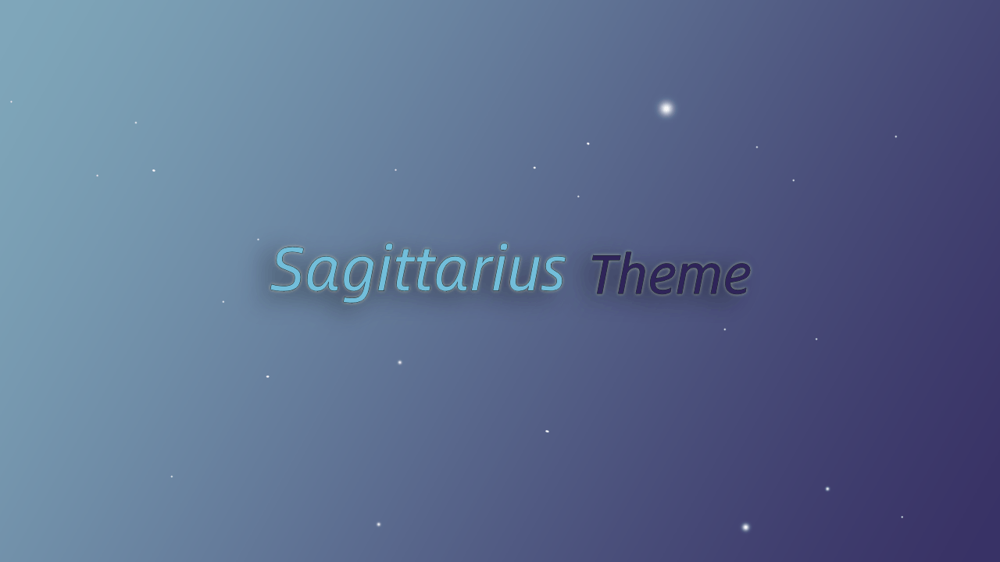

# Sagittarius Theme

一款仿微博风格的 Typecho 主题，简洁清爽，支持丰富的自定义配置。

## 说明

主题设计致力于提供干净简洁的阅读体验，同时保持较高的可定制性。

！注意：主题部分功能尚未完成，请考虑后使用。

## 特性

- **微博流式布局**：时间线式文章列表，沉浸式阅读体验
- **高度自定义**：保持较高的可定制性
- **代码高亮**：内置 Prism.js 语法高亮
- **响应式设计**：适配桌面端与移动端

## 环境要求

- Typecho 1.2+
- PHP 7.4+

## 安装

1. 下载主题压缩包或克隆仓库
2. 解压到 `usr/themes/` 目录
3. 登录 Typecho 后台 → 控制台 → 外观
4. 启用「Sagittarius」主题

## 许可证

本项目基于 [GNU General Public License v3.0](LICENSE) 开源。

## 赞助

感谢使用❤，如果觉得主题还不错，可以请我喝杯可乐~

